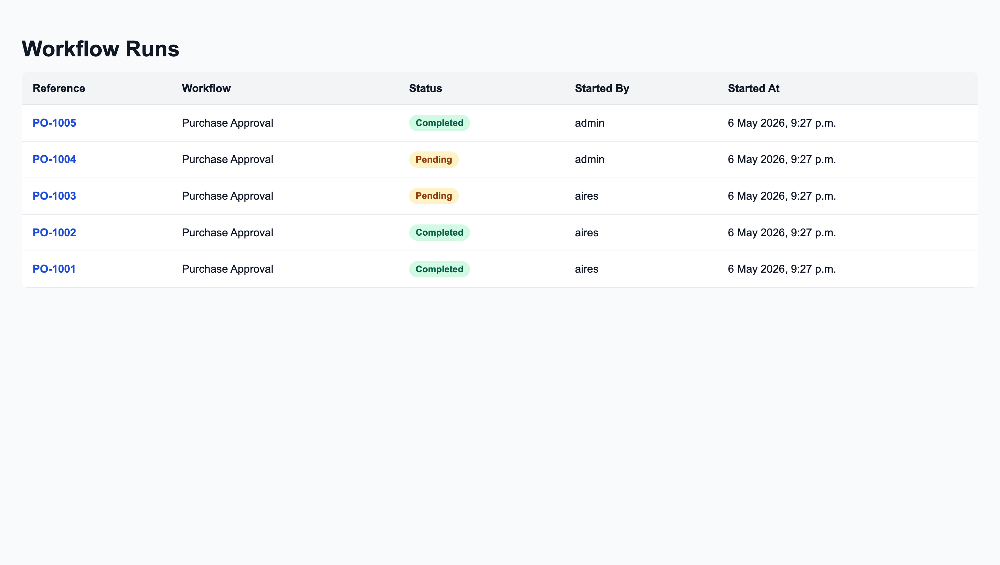
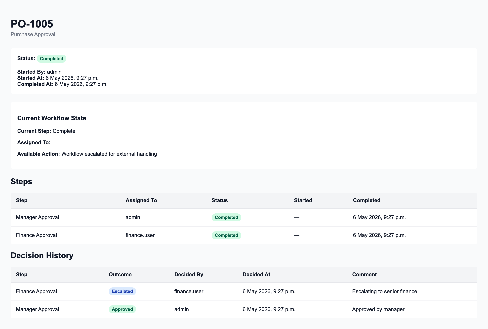

# OpsFlow

OpsFlow is a lightweight workflow approval engine built with Django.

It allows teams to define approval workflows, start workflow runs, assign decisions to specific actors, and track each step from start to completion.

This project was built to demonstrate backend workflow orchestration, approval state transitions, access control, and auditability in a clean Django application.

---

## Why this exists

Many internal business processes rely on approval chains:

- purchase approvals
- finance sign-off
- compliance review
- operational escalations

OpsFlow models that process in a reusable way.

It provides:

- reusable workflow definitions
- ordered approval steps
- actor-based task assignment
- decision capture
- full audit history
- admin tooling for workflow operations

---

## Tech Stack

- Python 3.12
- Django 5
- SQLite
- Django Admin
- Django Test Framework

---

## Features

- Create reusable workflow definitions
- Configure ordered workflow steps
- Start workflow runs from a reference
- Assign active steps to specific users
- Approve, reject, send back, or escalate
- Track workflow state in real time
- Record full decision history
- Secure decision submission by assigned actor only
- Admin bulk approval/rejection actions
- Full audit visibility in Django Admin

---

## Running locally

```bash
git clone <repo-url>
cd opsflow

python -m venv .venv
source .venv/bin/activate   # macOS / Linux
# .venv\Scripts\activate    # Windows

pip install -r requirements.txt
python manage.py migrate
python manage.py createsuperuser
python manage.py seed_demo_workflows
python manage.py runserver
```

---

## Demo Data

To reseed clean demo workflow data for local development:

```bash
python manage.py seed_demo_workflows
```

This will:

- reset demo workflow data
- recreate the Purchase Approval workflow
- seed sample workflow runs
- seed example approval decisions

---

## Local URLs

Workflow runs list:

```text
http://127.0.0.1:8000/workflows/
```

Admin:

```text
http://127.0.0.1:8000/admin/
```

---

## Demo Credentials

Use the superuser account created during setup to:

- access Django Admin
- review workflow definitions
- inspect workflow runs
- review audit history
- submit decisions

---

## What to review

Start here:

- `/workflows/` → workflow run list
- click any workflow reference
- inspect run state, step progression, and decision history

Then review:

- `/admin/` → workflow definitions, steps, runs, and decisions

---

## What this demonstrates

This project demonstrates:

- backend workflow orchestration
- approval routing and actor assignment
- state transition handling
- auditability and traceability
- access control and guarded decision submission
- practical Django service-layer architecture

## Screenshots

### Workflow Runs


### Workflow Run Detail
